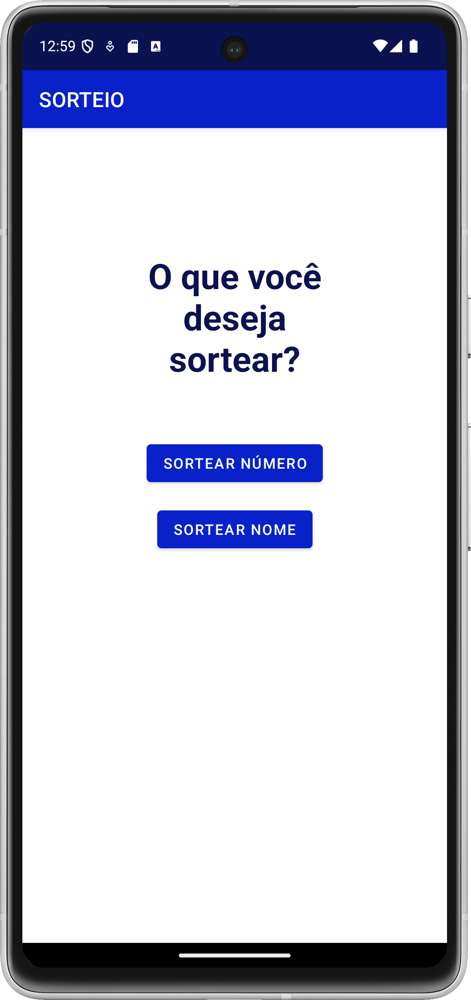
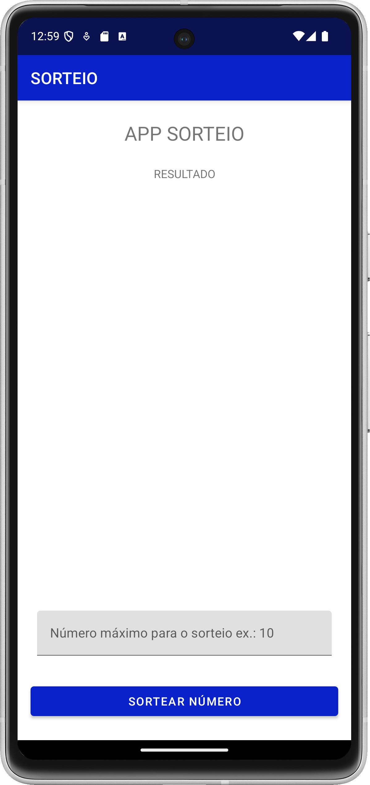
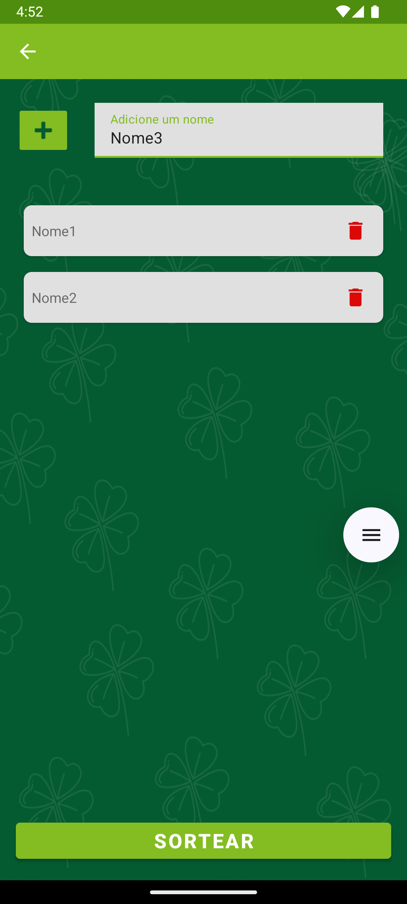
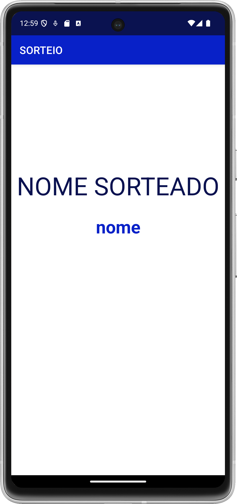

# APP SORTEIO  

## Finalidade do Projeto
Este aplicativo foi desenvolvido como parte de um projeto de estudo e aprendizado em desenvolvimento mobile. 
Ele tem como objetivo explorar boas práticas de programação e aprimorar habilidades técnicas.  

## Sobre o projeto
Este aplicativo foi desenvolvido para realizar sorteios de nomes ou números de forma simples e prática.  

## Conhecimentos colocados em prática
Criação de Modelos de Dados, Manipulação de RecyclerView, Gerenciamento de Navegação, Interação com a Interface Gráfica,
Geração de Resultados Aleatórios, Personalização de Layout e Tratamento de Estados e Validações.

## Telas do App
### Tela inicial
Tela exibida ao usuário após entrar no app. 
  

### Tela de sorteio de números.
Tela exibida ao usuário após este clicar em 'SORTEAR NÚMERO' na tela inicial. 
  

### Tela para adicionar nomes à lista
Tela exibida ao usuário após este clicar em 'SORTEAR NOME' na tela inicial.
Nesta tela o usuário adicionará os nomes participantes do sorteio. 
  

### Tela com o nome sorteado
Tela exibida ao usuário após clicar em 'SORTEAR' na tela onde os nomes foram adicionados.
Esta tela exibi o nome sorteado. 

