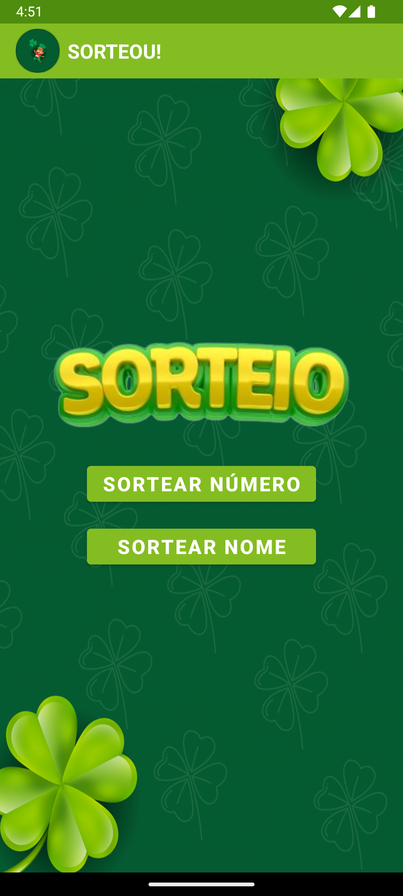
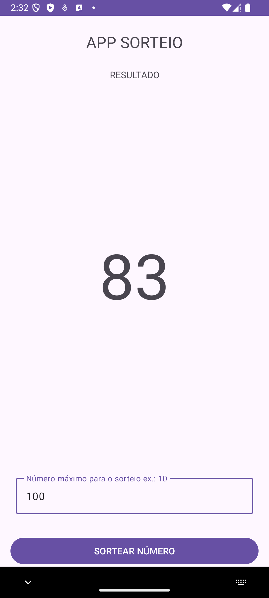

# APP SORTEIO

## Descrição do Projeto
Aplicativo Android para realizar sorteios numéricos. O usuário insere o valor máximo do intervalo, e, ao pressionar o botão, um número aleatório é gerado e exibido na tela. O projeto utiliza Kotlin e é uma prática básica para interações com a interface e geração de números aleatórios no Android.

